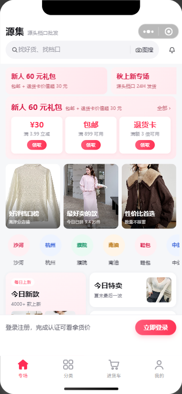

# 源集 · 服装批发小程序

面向服装批发场景的小程序 + 后端 + 运营后台（原型 → 可上线形态）。
结构参考「一手」小程序真机实测，覆盖 **找款 → 看档口 → 选色码 → 进货车 → 结算 → 订单/售后 → 分账 → 对账** 的完整闭环。



## 目录结构

```
├── outputs/
│   ├── yuanji-miniprogram/      微信小程序（客户端，22 个页面，原生）
│   ├── yuanji-server/           后端 API（Node 零依赖）+ 运营后台网页 public/admin.html
│   ├── docs/                    产品与技术方案 / 上线指引 / 微信支付 / 商家端与对账
│   ├── clothing-wholesale/      H5 原型（早期设计参考，已被小程序取代）
│   ├── 预览截图/miniprogram/     22 个页面截图 + 渲染核对报告
│   └── 工作进度.md              每一轮做了什么、验证结果、待办
└── work/                        校验与测试脚本（静态校验、实机渲染核对、各模块接口测试）
```

## 怎么跑

**后端**（Node ≥ 18，零依赖）

```powershell
cd outputs/yuanji-server
$env:ADMIN_TOKEN='你的运营口令'
node server.js          # http://127.0.0.1:3000 ；运营后台 http://127.0.0.1:3000/admin
```

**小程序**：用微信开发者工具导入 `outputs/yuanji-miniprogram`（测试号即可预览）。
接口地址在 `utils/config.js`，默认连本机 `http://127.0.0.1:3000/api/v1`；后端没启动时会自动退回本地演示数据。

**自检脚本**

```powershell
node work/check-miniprogram.mjs     # 页面/语法/JSON/事件绑定/图片路径静态校验
node work/verify-render.mjs         # 用微信开发者工具自动化跑 22 个页面截图 + 交互链路
```

## 已实现

- **价格闸门**：未认证只能看建议零售价，拿货价由**服务端**按认证状态返回（前端改代码也刷不出来）
- **批发规则**：一件起批、按档口拆单、18 档阶梯满减、24H 发货承诺与未发可取消
- **交易闭环**：进货车 → 结算试算 → 下单 → 支付 → 发货 → 收货 → 售后
- **售后工单**：买家提交（含凭证图）→ 档口同意/拒绝 → 退货物流 → 确认收货退款；超时未处理自动转平台仲裁
- **资金**：微信支付 APIv3（JSAPI 下单、回调验签解密、退款、查单）+ **分账**（平台代收按档口结算，防二清）+ 分账回退
- **商家端**：档口邀请码登录工作台 → 接单发货 → 多图上架/改价/库存（含规格库存）→ 结算与资质提交
- **运营后台**：总览 / 档口审核 / 订单 / 售后仲裁 / 分账 / 对账 / 档口邀请码 / 活动配置
- **对账**：账单汇总与导出、微信交易/资金账单下载、逐笔差异比对（漏单/金额不一致）与告警推送

## 上线前必须处理

1. 换成自己的小程序 AppID（注册企业/个体工商户主体）并完成**小程序备案**
2. 申请微信支付商户号，配好证书与 APIv3 密钥（环境变量见 `outputs/docs/微信支付接入说明.md`）
3. 部署后端到 **HTTPS 域名**并配置服务器域名、配置《用户隐私保护指引》
4. 把演示用的网图替换为自有商品实拍图

详细步骤见 `outputs/docs/上线与发布指引.md`。

> 说明：仓库内的商品图为演示用网络图片，仅用于原型展示；`data/` 运行数据（用户/订单/上传图/账单）未纳入版本管理。
